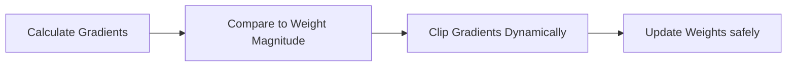

# The Adaptive Normalization-Free Era

NFNets achieved absolute scale-invariant optimization without any normalization layers by utilizing Adaptive Gradient Clipping (AGC) and specifically scaled residual branches.

[Back to README](../README.md)
