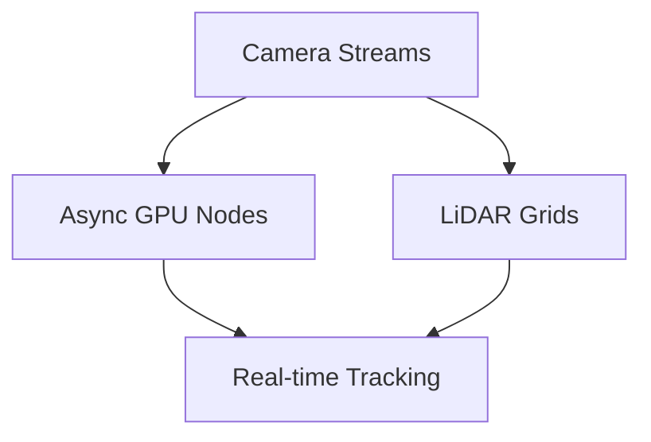

# Autonomous Driving (BEV)

Zero batch-dependency allows decoupled spatial feature extraction for fleets without node syncing.

```mermaid
flowchart TD
    A[Camera Streams] --> B[Async GPU Nodes]
    A --> C[LiDAR Grids]
    B --> D[Real-time Tracking]
    C --> D
```

[Back to README](../README.md)
