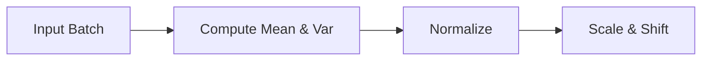

# The Batch Normalization Hegemony

Batch Normalization revolutionized deep network training by standardizing activations along the mini-batch dimension. This solved the vanishing/exploding gradient problem but introduced batch-size dependencies.

[Back to README](../README.md)
