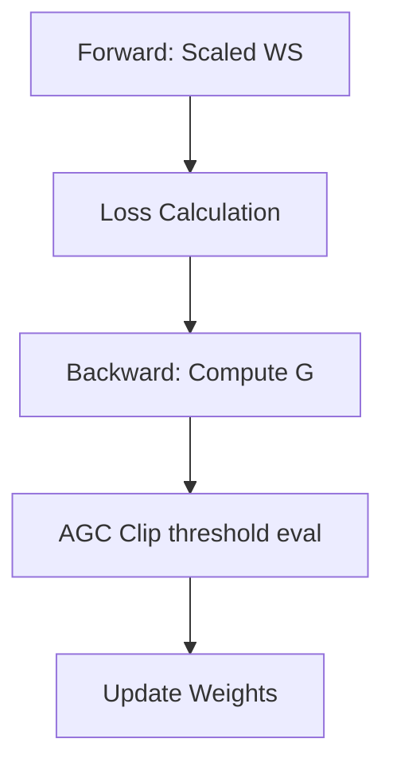

# Core NFNets (AGC Class)

Core NFNets use Scaled Weight Standardization along with Adaptive Gradient Clipping to maintain stability at very large scale training.

```mermaid
flowchart TD
    A[Forward: Scaled WS] --> B[Loss Calculation]
    B --> C[Backward: Compute G]
    C --> D[AGC Clip threshold eval]
    D --> E[Update Weights]
```

[Back to README](../README.md)
