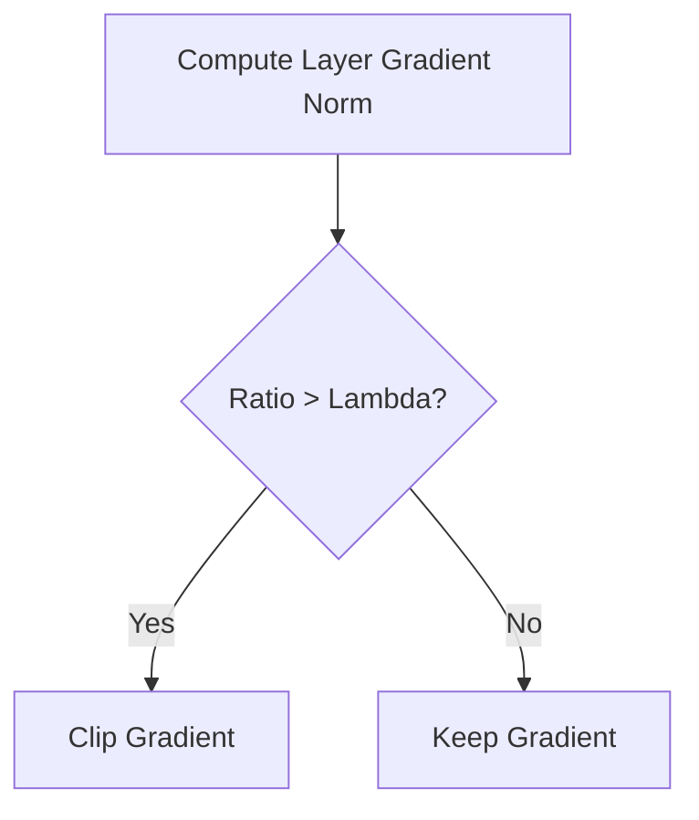

# The λ-Clipping Threshold

This hyperparameter regulates the max allowable gradient-to-weight ratio, binding step sizes safely.

```mermaid
flowchart TD
    A[Compute Layer Gradient Norm] --> B{Ratio > Lambda?}
    B -->|Yes| C[Clip Gradient]
    B -->|No| D[Keep Gradient]
```

[Back to README](../README.md)
