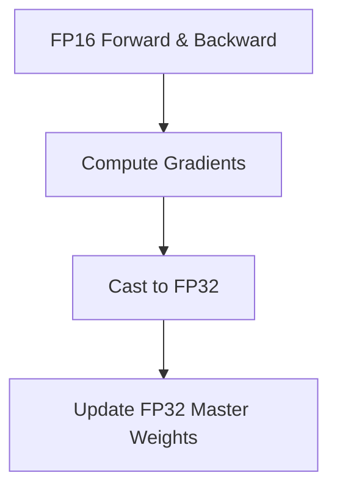

# Low-Precision Underflow Hazard

Terminal layer gradients might underflow in FP16. Maintaining an FP32 Master Weight fixes this.

```mermaid
flowchart TB
    A[FP16 Forward & Backward] --> B[Compute Gradients]
    B --> C[Cast to FP32]
    C --> D[Update FP32 Master Weights]
```

[Back to README](../README.md)
