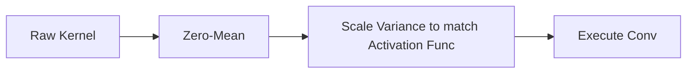

# Scaled Weight Standardization

It calibrates the kernel variance. It modifies convolutional weights before math steps, giving zero mean and tailored variance.

```mermaid
flowchart LR
    A[Raw Kernel] --> B[Zero-Mean]
    B --> C[Scale Variance to match Activation Func]
    C --> D[Execute Conv]
```

[Back to README](../README.md)
