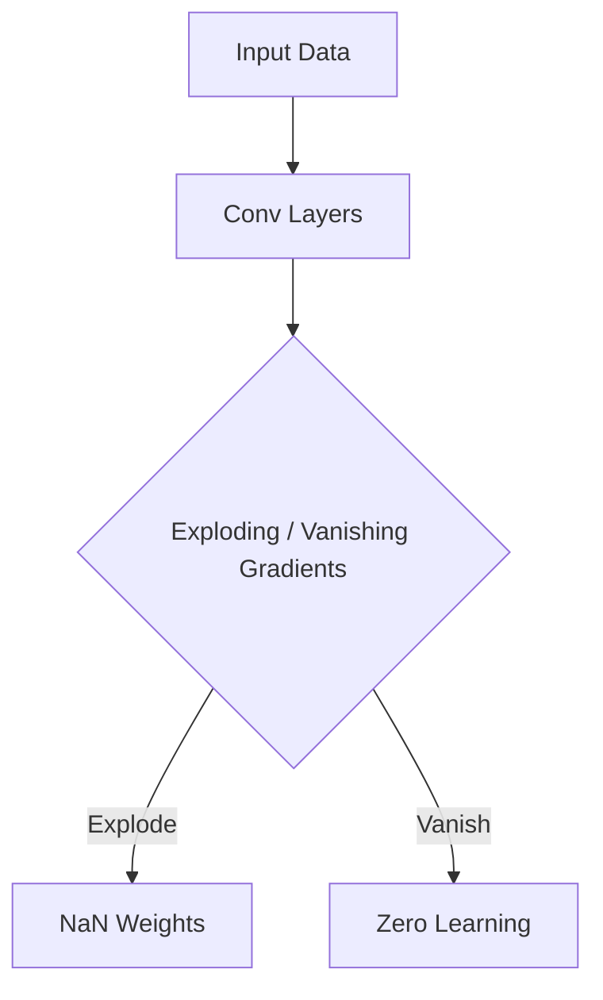

# The Un-normalized Exploding Era

The un-normalized exploding era of CNNs refers to the early days of deep learning where scaling deep neural networks caused massive instability. Without normalization layers, backpropagated gradients would either vanish or explode.

[Back to README](../README.md)
