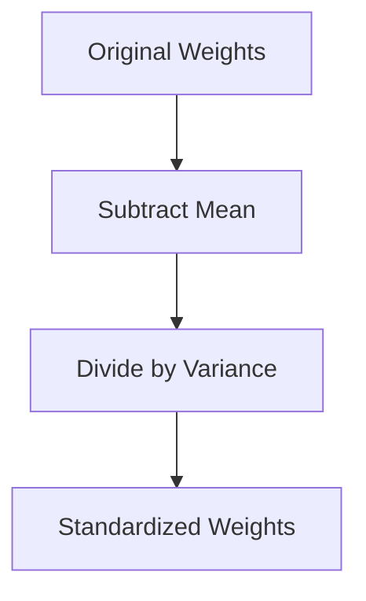

# Weight Standardization & BiT

Weight Standardization shifted the normalization focus from activations to the model weights themselves, avoiding batch dimension dependencies.

[Back to README](../README.md)
